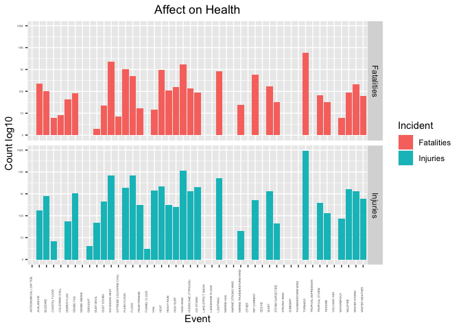
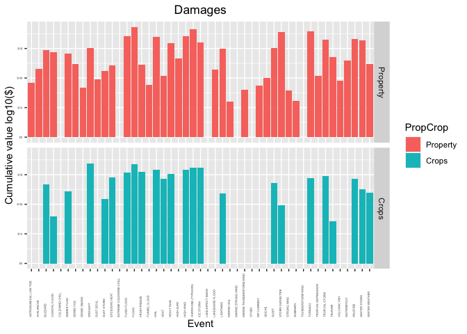

NOAA data analysis
================
Rithvik Shamrao Vinekar
2023-02-28

- <a href="#synopsis" id="toc-synopsis">Synopsis</a>
- <a href="#data-processing" id="toc-data-processing">Data Processing</a>
  - <a href="#session-info" id="toc-session-info">Session info</a>
  - <a href="#obtaining-the-data" id="toc-obtaining-the-data">Obtaining the
    data</a>
  - <a href="#check-the-data" id="toc-check-the-data">Check the data</a>
    - <a href="#preparation" id="toc-preparation">Preparation</a>
    - <a href="#uppercase-events" id="toc-uppercase-events">UPPERCASE
      Events</a>
    - <a href="#common-replacements" id="toc-common-replacements">Common
      replacements</a>
  - <a href="#damage-values" id="toc-damage-values">Damage Values</a>
- <a href="#results" id="toc-results">Results</a>
  - <a href="#population-health" id="toc-population-health">Population
    Health</a>
  - <a href="#damages-to-crops-and-property"
    id="toc-damages-to-crops-and-property">Damages to Crops and Property</a>

<!-- 
Has either a (1) valid RPubs URL pointing to a data analysis document for this assignment been submitted; or (2) a complete PDF file presenting the data analysis been uploaded?

Is the document written in English?

Does the analysis include description and justification for any data transformations?

Does the document have a title that briefly summarizes the data analysis?

Does the document have a synopsis that describes and summarizes the data analysis in less than 10 sentences?

Is there a section titled "Data Processing" that describes how the data were loaded into R and processed for analysis?

Is there a section titled "Results" where the main results are presented?

Is there at least one figure in the document that contains a plot?

Are there at most 3 figures in this document?

Does the analysis start from the raw data file (i.e. the original .csv.bz2 file)?

Does the analysis address the question of which types of events are most harmful to population health?

Does the analysis address the question of which types of events have the greatest economic consequences?

Do all the results of the analysis (i.e. figures, tables, numerical summaries) appear to be reproducible?

Do the figure(s) have descriptive captions (i.e. there is a description near the figure of what is happening in the figure)?

As far as you can determine, does it appear that the work submitted for this project is the work of the student who submitted it?

-->

# Synopsis

The National Oceanic and Atmospheric Administration department of the US
government collects data about storms and atmospheric events from across
the country. Specific people submit reports of the events which are then
collated into reports. These reports are made available as datasets for
researchers. One such dataset is provided at
<https://d396qusza40orc.cloudfront.net/repdata%2Fdata%2FStormData.csv.bz2>.There
is [linked
documentation](https://d396qusza40orc.cloudfront.net/repdata%2Fpeer2_doc%2Fpd01016005curr.pdf)
which tells us the format expected as well as the well-defined
categories of events, and much more information.

The databases provide information about property damages, crop damages,
fatalities and injuries reported, among other things. It also includes a
Remark, which has a verbal description of the event, as well as the
location of the event reported. This includes state and county
information, time of event and the latitude and longitude of the event.
The categories of events involve zones, such as County level or Marine
events.

The questions we need to answer are:

1.  Across the United States, which types of events (as indicated in
    the EVTYPE variable) are most harmful with respect to population
    health?

2.  Across the United States, which types of events have the greatest
    economic consequences?

Ideally, a thorough analysis of such a dataset would involve a thorough
reading of the Remarks in order to categorise the events. It is often
difficult to give a single category to an event as many phenomena can
occur simultaneously, but the number of fatalities, injuries or damages
refers to a single event. The location data can also tell if an event is
marine, coastal or a land event. Such a thorough study is beyond scope
of this document.

In this document, the provided Event data will be used. The early
datasets did not have a fixed format of entry or did not enforce it.
Thus the people who reported events have made entries which are
inconsistent and have many human errors. The major part of the analysis
involves cleaning and categorising the data into the events expected in
the documentation, and a few more which may help.

# Data Processing

This is the session info for the R session used currently:

## Session info

``` r
sessionInfo()
```

    ## R version 4.2.2 (2022-10-31)
    ## Platform: aarch64-apple-darwin20 (64-bit)
    ## Running under: macOS Ventura 13.2
    ## 
    ## Matrix products: default
    ## BLAS:   /Library/Frameworks/R.framework/Versions/4.2-arm64/Resources/lib/libRblas.0.dylib
    ## LAPACK: /Library/Frameworks/R.framework/Versions/4.2-arm64/Resources/lib/libRlapack.dylib
    ## 
    ## locale:
    ## [1] en_US.UTF-8/en_US.UTF-8/en_US.UTF-8/C/en_US.UTF-8/en_US.UTF-8
    ## 
    ## attached base packages:
    ## [1] stats     graphics  grDevices utils     datasets  methods   base     
    ## 
    ## loaded via a namespace (and not attached):
    ##  [1] compiler_4.2.2  fastmap_1.1.0   cli_3.6.0       tools_4.2.2    
    ##  [5] htmltools_0.5.4 rstudioapi_0.14 yaml_2.3.7      rmarkdown_2.20 
    ##  [9] knitr_1.42      xfun_0.36       digest_0.6.31   rlang_1.0.6    
    ## [13] evaluate_0.20

## Obtaining the data

Loading required libraries

``` r
library(tidyverse)
```

    ## ── Attaching packages ─────────────────────────────────────── tidyverse 1.3.2 ──
    ## ✔ ggplot2 3.4.0      ✔ purrr   1.0.1 
    ## ✔ tibble  3.1.8      ✔ dplyr   1.0.10
    ## ✔ tidyr   1.3.0      ✔ stringr 1.5.0 
    ## ✔ readr   2.1.3      ✔ forcats 0.5.2 
    ## ── Conflicts ────────────────────────────────────────── tidyverse_conflicts() ──
    ## ✖ dplyr::filter() masks stats::filter()
    ## ✖ dplyr::lag()    masks stats::lag()

``` r
library(sjmisc)
```

    ## 
    ## Attaching package: 'sjmisc'
    ## 
    ## The following object is masked from 'package:purrr':
    ## 
    ##     is_empty
    ## 
    ## The following object is masked from 'package:tidyr':
    ## 
    ##     replace_na
    ## 
    ## The following object is masked from 'package:tibble':
    ## 
    ##     add_case

We will write a code to download this data.

``` r
url_source<-"https://d396qusza40orc.cloudfront.net/repdata%2Fdata%2FStormData.csv.bz2"
file_dest <- "StormData.csv.bz2"
download.file(url_source,file_dest, method="libcurl")
rm( url_source, file_dest)
```

<!-- Method libcurl to ensure this works in Rmarkdown. Without this, -->
<!-- method=auto is default It works standalone, but fails on knit -->

Now we can read the compressed csv file directly into a dataframe which
we will call `stormdata`

``` r
stormdata <- read.csv("repdata%2Fdata%2FStormData.csv.bz2", encoding = "UTF-8")
```

## Check the data

The data read into `stormdata` needs to be checked, starting with str()

``` r
str(stormdata)
```

    ## 'data.frame':    902297 obs. of  37 variables:
    ##  $ STATE__   : num  1 1 1 1 1 1 1 1 1 1 ...
    ##  $ BGN_DATE  : chr  "4/18/1950 0:00:00" "4/18/1950 0:00:00" "2/20/1951 0:00:00" "6/8/1951 0:00:00" ...
    ##  $ BGN_TIME  : chr  "0130" "0145" "1600" "0900" ...
    ##  $ TIME_ZONE : chr  "CST" "CST" "CST" "CST" ...
    ##  $ COUNTY    : num  97 3 57 89 43 77 9 123 125 57 ...
    ##  $ COUNTYNAME: chr  "MOBILE" "BALDWIN" "FAYETTE" "MADISON" ...
    ##  $ STATE     : chr  "AL" "AL" "AL" "AL" ...
    ##  $ EVTYPE    : chr  "TORNADO" "TORNADO" "TORNADO" "TORNADO" ...
    ##  $ BGN_RANGE : num  0 0 0 0 0 0 0 0 0 0 ...
    ##  $ BGN_AZI   : chr  "" "" "" "" ...
    ##  $ BGN_LOCATI: chr  "" "" "" "" ...
    ##  $ END_DATE  : chr  "" "" "" "" ...
    ##  $ END_TIME  : chr  "" "" "" "" ...
    ##  $ COUNTY_END: num  0 0 0 0 0 0 0 0 0 0 ...
    ##  $ COUNTYENDN: logi  NA NA NA NA NA NA ...
    ##  $ END_RANGE : num  0 0 0 0 0 0 0 0 0 0 ...
    ##  $ END_AZI   : chr  "" "" "" "" ...
    ##  $ END_LOCATI: chr  "" "" "" "" ...
    ##  $ LENGTH    : num  14 2 0.1 0 0 1.5 1.5 0 3.3 2.3 ...
    ##  $ WIDTH     : num  100 150 123 100 150 177 33 33 100 100 ...
    ##  $ F         : int  3 2 2 2 2 2 2 1 3 3 ...
    ##  $ MAG       : num  0 0 0 0 0 0 0 0 0 0 ...
    ##  $ FATALITIES: num  0 0 0 0 0 0 0 0 1 0 ...
    ##  $ INJURIES  : num  15 0 2 2 2 6 1 0 14 0 ...
    ##  $ PROPDMG   : num  25 2.5 25 2.5 2.5 2.5 2.5 2.5 25 25 ...
    ##  $ PROPDMGEXP: chr  "K" "K" "K" "K" ...
    ##  $ CROPDMG   : num  0 0 0 0 0 0 0 0 0 0 ...
    ##  $ CROPDMGEXP: chr  "" "" "" "" ...
    ##  $ WFO       : chr  "" "" "" "" ...
    ##  $ STATEOFFIC: chr  "" "" "" "" ...
    ##  $ ZONENAMES : chr  "" "" "" "" ...
    ##  $ LATITUDE  : num  3040 3042 3340 3458 3412 ...
    ##  $ LONGITUDE : num  8812 8755 8742 8626 8642 ...
    ##  $ LATITUDE_E: num  3051 0 0 0 0 ...
    ##  $ LONGITUDE_: num  8806 0 0 0 0 ...
    ##  $ REMARKS   : chr  "" "" "" "" ...
    ##  $ REFNUM    : num  1 2 3 4 5 6 7 8 9 10 ...

There are 902297 entries

The questions needed to answer are again:

1.  Across the United States, which types of events (as indicated in
    the EVTYPE variable) are most harmful with respect to population
    health?

2.  Across the United States, which types of events have the greatest
    economic consequences?

The two questions involve comparing EVTYPE with

1.  FATALITIES and INJURIES

2.  PROPDMG and CROPDMG

In the latter case, there is a need to get damage expenses in a
numerical format in the same unit. This is currently not so, as
PROPDMGEXP and CROPDMGEXP hold unit multipliers like ““,”K”, “M”,“B”
which stand basically for 1, 1,000, 1,000,000, 1,000,000,000 units or
none, Kilo, Million and Billion. This info is available in [linked
documentation](https://d396qusza40orc.cloudfront.net/repdata%2Fpeer2_doc%2Fpd01016005curr.pdf)

Before any of this is done, check EVTYPE if it is correct. According to
[linked
documentation](https://d396qusza40orc.cloudfront.net/repdata%2Fpeer2_doc%2Fpd01016005curr.pdf)
(Table 1, Page 6), there are finite number of types. This data is
available on the pdf file, under the heading

> **2.1.1 Storm Data Event Table**

These types were put in a text file from this documentation by copy and
paste. To make it a csv file, a grep search&replace using
`/\s([ZCM])$/,\1/` to replace the space separating Z or C or M at the
end of the line with a comma was done. This file has been saved as
`"Stormdata_EvType.csv"` with contents that look like below:-

    Astronomical Low Tide,Z
    Avalanche,Z
    Blizzard,Z
    Coastal Flood,Z
    Cold/Wind Chill,Z
    Debris Flow,C
    Dense Fog,Z
    Dense Smoke,Z
    Drought,Z
    Dust Devil,C
    Dust Storm,Z
    ...

This was read into a variable dataframe stormevents from the csv file

``` r
stormevents <- read.csv("Stormdata_EvType.csv", header = FALSE)
str(stormevents)
```

    ## 'data.frame':    48 obs. of  2 variables:
    ##  $ V1: chr  "Astronomical Low Tide" "Avalanche" "Blizzard" "Coastal Flood" ...
    ##  $ V2: chr  "Z" "Z" "Z" "Z" ...

Give the stormevents dataframe proper header names

``` r
names(stormevents)<-c("Event_name","Designator")
stormevents$Event_name<-toupper(stormevents$Event_name)
stormevents =  stormevents %>%
    arrange(desc(str_length(Event_name)), Event_name)
```

Now we need to check if the events in the EVTYPE entry match these

``` r
length(unique(stormdata$EVTYPE))
```

    ## [1] 985

There are 985 unique entries instead of 48.

``` r
uniqueEvTypes <- data.frame(EVTYPE=unique(stormdata$EVTYPE))
uniqueEvTypes
```

    ##                             EVTYPE
    ## 1                          TORNADO
    ## 2                        TSTM WIND
    ## 3                             HAIL
    ## 4                    FREEZING RAIN
    ## 5                             SNOW
    ## 6            ICE STORM/FLASH FLOOD
    ## 7                         SNOW/ICE
    ## 8                     WINTER STORM
    ## 9        HURRICANE OPAL/HIGH WINDS
    ## 10              THUNDERSTORM WINDS
    ## 11                     RECORD COLD
    ## 12                  HURRICANE ERIN
    ## 13                  HURRICANE OPAL
    ## 14                      HEAVY RAIN
    ## 15                       LIGHTNING
    ## 16               THUNDERSTORM WIND
    ## 17                       DENSE FOG
    ## 18                     RIP CURRENT
    ## 19               THUNDERSTORM WINS
    ## 20                     FLASH FLOOD
    ## 21                  FLASH FLOODING
    ## 22                      HIGH WINDS
    ## 23                    FUNNEL CLOUD
    ## 24                      TORNADO F0
    ## 25    THUNDERSTORM WINDS LIGHTNING
    ## 26         THUNDERSTORM WINDS/HAIL
    ## 27                            HEAT
    ## 28                            WIND
    ## 29                        LIGHTING
    ## 30                     HEAVY RAINS
    ## 31        LIGHTNING AND HEAVY RAIN
    ## 32                          FUNNEL
    ## 33                      WALL CLOUD
    ## 34                        FLOODING
    ## 35         THUNDERSTORM WINDS HAIL
    ## 36                           FLOOD
    ## 37                            COLD
    ## 38            HEAVY RAIN/LIGHTNING
    ## 39  FLASH FLOODING/THUNDERSTORM WI
    ## 40         WALL CLOUD/FUNNEL CLOUD
    ## 41                    THUNDERSTORM
    ## 42                      WATERSPOUT
    ## 43                    EXTREME COLD
    ## 44                      HAIL 1.75)
    ## 45            LIGHTNING/HEAVY RAIN
    ## 46                       HIGH WIND
    ## 47                        BLIZZARD
    ## 48                BLIZZARD WEATHER
    ## 49                      WIND CHILL
    ## 50                BREAKUP FLOODING
    ## 51              HIGH WIND/BLIZZARD
    ## 52                     RIVER FLOOD
    ## 53                      HEAVY SNOW
    ## 54                          FREEZE
    ## 55                   COASTAL FLOOD
    ## 56        HIGH WIND AND HIGH TIDES
    ## 57  HIGH WIND/BLIZZARD/FREEZING RA
    ## 58                      HIGH TIDES
    ## 59        HIGH WIND AND HEAVY SNOW
    ## 60       RECORD COLD AND HIGH WIND
    ## 61         RECORD HIGH TEMPERATURE
    ## 62                     RECORD HIGH
    ## 63          HIGH WINDS HEAVY RAINS
    ## 64             HIGH WIND/ BLIZZARD
    ## 65                       ICE STORM
    ## 66              BLIZZARD/HIGH WIND
    ## 67        HIGH WIND/LOW WIND CHILL
    ## 68                 HEAVY SNOW/HIGH
    ## 69                      RECORD LOW
    ## 70       HIGH WINDS AND WIND CHILL
    ## 71  HEAVY SNOW/HIGH WINDS/FREEZING
    ## 72          LOW TEMPERATURE RECORD
    ## 73                       AVALANCHE
    ## 74                   MARINE MISHAP
    ## 75            WIND CHILL/HIGH WIND
    ## 76   HIGH WIND/WIND CHILL/BLIZZARD
    ## 77            HIGH WIND/WIND CHILL
    ## 78            HIGH WIND/HEAVY SNOW
    ## 79         HIGH TEMPERATURE RECORD
    ## 80                    FLOOD WATCH/
    ## 81        RECORD HIGH TEMPERATURES
    ## 82                  HIGH WIND/SEAS
    ## 83           HIGH WINDS/HEAVY RAIN
    ## 84                       HIGH SEAS
    ## 85               SEVERE TURBULENCE
    ## 86                 RECORD RAINFALL
    ## 87                 RECORD SNOWFALL
    ## 88                   RECORD WARMTH
    ## 89                 HEAVY SNOW/WIND
    ## 90                    EXTREME HEAT
    ## 91                     WIND DAMAGE
    ## 92                      DUST STORM
    ## 93                   APACHE COUNTY
    ## 94                           SLEET
    ## 95                      HAIL STORM
    ## 96                   FUNNEL CLOUDS
    ## 97                    FLASH FLOODS
    ## 98                      DUST DEVIL
    ## 99                  EXCESSIVE HEAT
    ## 100 THUNDERSTORM WINDS/FUNNEL CLOU
    ## 101         WINTER STORM/HIGH WIND
    ## 102        WINTER STORM/HIGH WINDS
    ## 103                    GUSTY WINDS
    ## 104                   STRONG WINDS
    ## 105            FLOODING/HEAVY RAIN
    ## 106                  SNOW AND WIND
    ## 107    HEAVY SURF COASTAL FLOODING
    ## 108                     HEAVY SURF
    ## 109            HEAVY PRECIPATATION
    ## 110                 URBAN FLOODING
    ## 111                      HIGH SURF
    ## 112                   BLOWING DUST
    ## 113                    URBAN/SMALL
    ## 114                     WILD FIRES
    ## 115                           HIGH
    ## 116           URBAN/SMALL FLOODING
    ## 117                    WATER SPOUT
    ## 118          HIGH WINDS DUST STORM
    ## 119        WINTER STORM HIGH WINDS
    ## 120                    LOCAL FLOOD
    ## 121                  WINTER STORMS
    ## 122                      MUDSLIDES
    ## 123                      RAINSTORM
    ## 124            SEVERE THUNDERSTORM
    ## 125           SEVERE THUNDERSTORMS
    ## 126      SEVERE THUNDERSTORM WINDS
    ## 127            THUNDERSTORMS WINDS
    ## 128                 DRY MICROBURST
    ## 129              FLOOD/FLASH FLOOD
    ## 130               FLOOD/RAIN/WINDS
    ## 131                          WINDS
    ## 132              DRY MICROBURST 61
    ## 133                  THUNDERSTORMS
    ## 134              FLASH FLOOD WINDS
    ## 135    URBAN/SMALL STREAM FLOODING
    ## 136                     MICROBURST
    ## 137                    STRONG WIND
    ## 138               HIGH WIND DAMAGE
    ## 139                STREAM FLOODING
    ## 140                URBAN AND SMALL
    ## 141                 HEAVY SNOWPACK
    ## 142                            ICE
    ## 143                   FLASH FLOOD/
    ## 144                      DOWNBURST
    ## 145                   GUSTNADO AND
    ## 146                FLOOD/RAIN/WIND
    ## 147                 WET MICROBURST
    ## 148                DOWNBURST WINDS
    ## 149           DRY MICROBURST WINDS
    ## 150           DRY MIRCOBURST WINDS
    ## 151              DRY MICROBURST 53
    ## 152       SMALL STREAM URBAN FLOOD
    ## 153               MICROBURST WINDS
    ## 154                  HIGH WINDS 57
    ## 155              DRY MICROBURST 50
    ## 156                  HIGH WINDS 66
    ## 157                  HIGH WINDS 76
    ## 158                  HIGH WINDS 63
    ## 159                  HIGH WINDS 67
    ## 160            BLIZZARD/HEAVY SNOW
    ## 161          HEAVY SNOW/HIGH WINDS
    ## 162                   BLOWING SNOW
    ## 163                  HIGH WINDS 82
    ## 164                  HIGH WINDS 80
    ## 165                  HIGH WINDS 58
    ## 166               FREEZING DRIZZLE
    ## 167  LIGHTNING THUNDERSTORM WINDSS
    ## 168              DRY MICROBURST 58
    ## 169                        HAIL 75
    ## 170                  HIGH WINDS 73
    ## 171                  HIGH WINDS 55
    ## 172           LIGHT SNOW AND SLEET
    ## 173                    URBAN FLOOD
    ## 174              DRY MICROBURST 84
    ## 175          THUNDERSTORM WINDS 60
    ## 176            HEAVY RAIN/FLOODING
    ## 177            THUNDERSTORM WINDSS
    ## 178                       TORNADOS
    ## 179                          GLAZE
    ## 180                    RECORD HEAT
    ## 181               COASTAL FLOODING
    ## 182                      HEAT WAVE
    ## 183                     FIRST SNOW
    ## 184        FREEZING RAIN AND SLEET
    ## 185               UNSEASONABLY DRY
    ## 186               UNSEASONABLY WET
    ## 187                     WINTRY MIX
    ## 188                 WINTER WEATHER
    ## 189              UNSEASONABLY COLD
    ## 190            EXTREME/RECORD COLD
    ## 191        RIP CURRENTS HEAVY SURF
    ## 192                SLEET/RAIN/SNOW
    ## 193              UNSEASONABLY WARM
    ## 194                        DROUGHT
    ## 195           NORMAL PRECIPITATION
    ## 196            HIGH WINDS/FLOODING
    ## 197                            DRY
    ## 198                      RAIN/SNOW
    ## 199                SNOW/RAIN/SLEET
    ## 200             WATERSPOUT/TORNADO
    ## 201                    WATERSPOUTS
    ## 202             WATERSPOUT TORNADO
    ## 203       URBAN/SMALL STREAM FLOOD
    ## 204                    STORM SURGE
    ## 205             WATERSPOUT-TORNADO
    ## 206                    WATERSPOUT-
    ## 207     TORNADOES, TSTM WIND, HAIL
    ## 208         TROPICAL STORM ALBERTO
    ## 209                 TROPICAL STORM
    ## 210          TROPICAL STORM GORDON
    ## 211           TROPICAL STORM JERRY
    ## 212   LIGHTNING THUNDERSTORM WINDS
    ## 213                    WAYTERSPOUT
    ## 214                 MINOR FLOODING
    ## 215               LIGHTNING INJURY
    ## 216      URBAN/SMALL STREAM  FLOOD
    ## 217 LIGHTNING AND THUNDERSTORM WIN
    ## 218           THUNDERSTORM WINDS53
    ## 219   URBAN AND SMALL STREAM FLOOD
    ## 220         URBAN AND SMALL STREAM
    ## 221                       WILDFIRE
    ## 222                DAMAGING FREEZE
    ## 223          THUNDERSTORM WINDS 13
    ## 224                     SMALL HAIL
    ## 225           HEAVY SNOW/HIGH WIND
    ## 226                      HURRICANE
    ## 227               WILD/FOREST FIRE
    ## 228          SMALL STREAM FLOODING
    ## 229                      MUD SLIDE
    ## 230                      LIGNTNING
    ## 231                          FROST
    ## 232             FREEZING RAIN/SNOW
    ## 233                    HIGH WINDS/
    ## 234                    THUNDERSNOW
    ## 235                         FLOODS
    ## 236            EXTREME WIND CHILLS
    ## 237                   COOL AND WET
    ## 238                HEAVY RAIN/SNOW
    ## 239 SMALL STREAM AND URBAN FLOODIN
    ## 240       SMALL STREAM/URBAN FLOOD
    ## 241       SNOW/SLEET/FREEZING RAIN
    ## 242                    SEVERE COLD
    ## 243                      GLAZE ICE
    ## 244                      COLD WAVE
    ## 245                     EARLY SNOW
    ## 246   SMALL STREAM AND URBAN FLOOD
    ## 247                    HIGH  WINDS
    ## 248                    RURAL FLOOD
    ## 249               SMALL STREAM AND
    ## 250                     MUD SLIDES
    ## 251                        HAIL 80
    ## 252             EXTREME WIND CHILL
    ## 253        COLD AND WET CONDITIONS
    ## 254              EXCESSIVE WETNESS
    ## 255                 GRADIENT WINDS
    ## 256        HEAVY SNOW/BLOWING SNOW
    ## 257                SLEET/ICE STORM
    ## 258 THUNDERSTORM WINDS URBAN FLOOD
    ## 259 THUNDERSTORM WINDS SMALL STREA
    ## 260            ROTATING WALL CLOUD
    ## 261               LARGE WALL CLOUD
    ## 262                COLD AIR FUNNEL
    ## 263                       GUSTNADO
    ## 264               COLD AIR FUNNELS
    ## 265 BLOWING SNOW- EXTREME WIND CHI
    ## 266            SNOW AND HEAVY SNOW
    ## 267                GROUND BLIZZARD
    ## 268                    MAJOR FLOOD
    ## 269                SNOW/HEAVY SNOW
    ## 270            FREEZING RAIN/SLEET
    ## 271               ICE JAM FLOODING
    ## 272    SNOW- HIGH WIND- WIND CHILL
    ## 273                   STREET FLOOD
    ## 274               COLD AIR TORNADO
    ## 275             SMALL STREAM FLOOD
    ## 276                            FOG
    ## 277           THUNDERSTORM WINDS 2
    ## 278              FUNNEL CLOUD/HAIL
    ## 279                       ICE/SNOW
    ## 280                   TSTM WIND 51
    ## 281                   TSTM WIND 50
    ## 282                   TSTM WIND 52
    ## 283                   TSTM WIND 55
    ## 284            HEAVY SNOW/BLIZZARD
    ## 285          THUNDERSTORM WINDS 61
    ## 286                      HAIL 0.75
    ## 287            THUNDERSTORM DAMAGE
    ## 288              THUNDERTORM WINDS
    ## 289                      HAIL 1.00
    ## 290                     HAIL/WINDS
    ## 291                   SNOW AND ICE
    ## 292                     WIND STORM
    ## 293                      SNOWSTORM
    ## 294                    GRASS FIRES
    ## 295                     LAKE FLOOD
    ## 296                   PROLONG COLD
    ## 297                      HAIL/WIND
    ## 298                      HAIL 1.75
    ## 299               THUNDERSTORMW 50
    ## 300                      WIND/HAIL
    ## 301             SNOW AND ICE STORM
    ## 302 URBAN AND SMALL STREAM FLOODIN
    ## 303             THUNDERSTORMS WIND
    ## 304            THUNDERSTORM  WINDS
    ## 305               HEAVY SNOW/SLEET
    ## 306            AGRICULTURAL FREEZE
    ## 307         DROUGHT/EXCESSIVE HEAT
    ## 308               TUNDERSTORM WIND
    ## 309            TROPICAL STORM DEAN
    ## 310              THUNDERTSORM WIND
    ## 311       THUNDERSTORM WINDS/ HAIL
    ## 312    THUNDERSTORM WIND/LIGHTNING
    ## 313      HEAVY RAIN/SEVERE WEATHER
    ## 314              THUNDESTORM WINDS
    ## 315            WATERSPOUT/ TORNADO
    ## 316                     LIGHTNING.
    ## 317            WARM DRY CONDITIONS
    ## 318     HURRICANE-GENERATED SWELLS
    ## 319           HEAVY SNOW/ICE STORM
    ## 320         RIVER AND STREAM FLOOD
    ## 321                   HIGH WIND 63
    ## 322                  COASTAL SURGE
    ## 323       HEAVY SNOW AND ICE STORM
    ## 324                    MINOR FLOOD
    ## 325       HIGH WINDS/COASTAL FLOOD
    ## 326                           RAIN
    ## 327                 RIVER FLOODING
    ## 328                      SNOW/RAIN
    ## 329                      ICE FLOES
    ## 330                     HIGH WAVES
    ## 331                   SNOW SQUALLS
    ## 332                    SNOW SQUALL
    ## 333          THUNDERSTORM WIND G50
    ## 334                 LIGHTNING FIRE
    ## 335         BLIZZARD/FREEZING RAIN
    ## 336                HEAVY LAKE SNOW
    ## 337       HEAVY SNOW/FREEZING RAIN
    ## 338               LAKE EFFECT SNOW
    ## 339                 HEAVY WET SNOW
    ## 340          DUST DEVIL WATERSPOUT
    ## 341  THUNDERSTORM WINDS/HEAVY RAIN
    ## 342             THUNDERSTROM WINDS
    ## 343 THUNDERSTORM WINDS      LE CEN
    ## 344                       HAIL 225
    ## 345        BLIZZARD AND HEAVY SNOW
    ## 346             HEAVY SNOW AND ICE
    ## 347             ICE STORM AND SNOW
    ## 348     HEAVY SNOW ANDBLOWING SNOW
    ## 349                 HEAVY SNOW/ICE
    ## 350 BLIZZARD AND EXTREME WIND CHIL
    ## 351                 LOW WIND CHILL
    ## 352 BLOWING SNOW & EXTREME WIND CH
    ## 353                    WATERSPOUT/
    ## 354             URBAN/SMALL STREAM
    ## 355                     TORNADO F3
    ## 356                  FUNNEL CLOUD.
    ## 357                        TORNDAO
    ## 358                      HAIL 0.88
    ## 359              FLOOD/RIVER FLOOD
    ## 360      MUD SLIDES URBAN FLOODING
    ## 361                     TORNADO F1
    ## 362           THUNDERSTORM WINDS G
    ## 363                      DEEP HAIL
    ## 364                GLAZE/ICE STORM
    ## 365        HEAVY SNOW/WINTER STORM
    ## 366                       AVALANCE
    ## 367          BLIZZARD/WINTER STORM
    ## 368          DUST STORM/HIGH WINDS
    ## 369                        ICE JAM
    ## 370                   FOREST FIRES
    ## 371          THUNDERSTORM WIND G60
    ## 372                  FROST\\FREEZE
    ## 373            THUNDERSTORM WINDS.
    ## 374                        HAIL 88
    ## 375                       HAIL 175
    ## 376                       HVY RAIN
    ## 377                       HAIL 100
    ## 378                       HAIL 150
    ## 379                       HAIL 075
    ## 380          THUNDERSTORM WIND G55
    ## 381                       HAIL 125
    ## 382         THUNDERSTORM WINDS G60
    ## 383                    HARD FREEZE
    ## 384                       HAIL 200
    ## 385 THUNDERSTORM WINDS FUNNEL CLOU
    ## 386          THUNDERSTORM WINDS 62
    ## 387                      WILDFIRES
    ## 388               RECORD HEAT WAVE
    ## 389      HEAVY SNOW AND HIGH WINDS
    ## 390  HEAVY SNOW/HIGH WINDS & FLOOD
    ## 391                  HAIL FLOODING
    ## 392 THUNDERSTORM WINDS/FLASH FLOOD
    ## 393                   HIGH WIND 70
    ## 394                       WET SNOW
    ## 395           HEAVY RAIN AND FLOOD
    ## 396              LOCAL FLASH FLOOD
    ## 397          THUNDERSTORM WINDS 53
    ## 398           FLOOD/FLASH FLOODING
    ## 399             TORNADO/WATERSPOUT
    ## 400                  RAIN AND WIND
    ## 401           THUNDERSTORM WIND 59
    ## 402           THUNDERSTORM WIND 52
    ## 403            COASTAL/TIDAL FLOOD
    ## 404                 SNOW/ICE STORM
    ## 405     BELOW NORMAL PRECIPITATION
    ## 406        RIP CURRENTS/HEAVY SURF
    ## 407              FLASH FLOOD/FLOOD
    ## 408                 EXCESSIVE RAIN
    ## 409          RECORD/EXCESSIVE HEAT
    ## 410                     HEAT WAVES
    ## 411                     LIGHT SNOW
    ## 412           THUNDERSTORM WIND 69
    ## 413                    HAIL DAMAGE
    ## 414               LIGHTNING DAMAGE
    ## 415            RECORD TEMPERATURES
    ## 416            LIGHTNING AND WINDS
    ## 417      FOG AND COLD TEMPERATURES
    ## 418                          OTHER
    ## 419                    RECORD SNOW
    ## 420                      SNOW/COLD
    ## 421      FLASH FLOOD FROM ICE JAMS
    ## 422                  TSTM WIND G58
    ## 423                       MUDSLIDE
    ## 424             HEAVY SNOW SQUALLS
    ## 425             HEAVY SNOW/SQUALLS
    ## 426             HEAVY SNOW-SQUALLS
    ## 427                      ICY ROADS
    ## 428                      HEAVY MIX
    ## 429             SNOW FREEZING RAIN
    ## 430                   LACK OF SNOW
    ## 431                     SNOW/SLEET
    ## 432             SNOW/FREEZING RAIN
    ## 433                   SNOW DROUGHT
    ## 434            THUNDERSTORMW WINDS
    ## 435       THUNDERSTORM WIND 60 MPH
    ## 436        THUNDERSTORM WIND 65MPH
    ## 437       THUNDERSTORM WIND/ TREES
    ## 438       THUNDERSTORM WIND/AWNING
    ## 439       THUNDERSTORM WIND 98 MPH
    ## 440        THUNDERSTORM WIND TREES
    ## 441                TORRENTIAL RAIN
    ## 442                     TORNADO F2
    ## 443                   RIP CURRENTS
    ## 444                HURRICANE EMILY
    ## 445               HURRICANE GORDON
    ## 446                HURRICANE FELIX
    ## 447       THUNDERSTORM WIND 59 MPH
    ## 448      THUNDERSTORM WINDS 63 MPH
    ## 449        THUNDERSTORM WIND/ TREE
    ## 450         THUNDERSTORM DAMAGE TO
    ## 451       THUNDERSTORM WIND 65 MPH
    ## 452       FLASH FLOOD - HEAVY RAIN
    ## 453             THUNDERSTORM WIND.
    ## 454            FLASH FLOOD/ STREET
    ## 455      THUNDERSTORM WIND 59 MPH.
    ## 456     HEAVY SNOW   FREEZING RAIN
    ## 457                    DAM FAILURE
    ## 458              THUNDERSTORM HAIL
    ## 459                       HAIL 088
    ## 460         THUNDERSTORM WINDSHAIL
    ## 461             LIGHTNING  WAUSEON
    ## 462              THUDERSTORM WINDS
    ## 463                   ICE AND SNOW
    ## 464              RECORD COLD/FROST
    ## 465              STORM FORCE WINDS
    ## 466         FREEZING RAIN AND SNOW
    ## 467        FREEZING RAIN SLEET AND
    ## 468                      SOUTHEAST
    ## 469               HEAVY SNOW & ICE
    ## 470  FREEZING DRIZZLE AND FREEZING
    ## 471         THUNDERSTORM WINDS AND
    ## 472                 HAIL/ICY ROADS
    ## 473         FLASH FLOOD/HEAVY RAIN
    ## 474 HEAVY RAIN; URBAN FLOOD WINDS;
    ## 475            HEAVY PRECIPITATION
    ## 476               TSTM WIND DAMAGE
    ## 477                     HIGH WATER
    ## 478                    FLOOD FLASH
    ## 479                      RAIN/WIND
    ## 480          THUNDERSTORM WINDS 50
    ## 481          THUNDERSTORM WIND G52
    ## 482              FLOOD FLOOD/FLASH
    ## 483          THUNDERSTORM WINDS 52
    ## 484                   SNOW SHOWERS
    ## 485          THUNDERSTORM WIND G51
    ## 486              HEAT WAVE DROUGHT
    ## 487  HEAVY SNOW/BLIZZARD/AVALANCHE
    ## 488               RECORD SNOW/COLD
    ## 489                    WET WEATHER
    ## 490      UNSEASONABLY WARM AND DRY
    ## 491  FREEZING RAIN SLEET AND LIGHT
    ## 492      RECORD/EXCESSIVE RAINFALL
    ## 493                    TIDAL FLOOD
    ## 494                   BEACH EROSIN
    ## 495          THUNDERSTORM WIND G61
    ## 496                    FLOOD/FLASH
    ## 497                LOW TEMPERATURE
    ## 498          SLEET & FREEZING RAIN
    ## 499           HEAVY RAINS/FLOODING
    ## 500            THUNDERESTORM WINDS
    ## 501    THUNDERSTORM WINDS/FLOODING
    ## 502            THUNDEERSTORM WINDS
    ## 503               HIGHWAY FLOODING
    ## 504            THUNDERSTORM W INDS
    ## 505                    HYPOTHERMIA
    ## 506             FLASH FLOOD/ FLOOD
    ## 507           THUNDERSTORM WIND 50
    ## 508              THUNERSTORM WINDS
    ## 509     HEAVY RAIN/MUDSLIDES/FLOOD
    ## 510                 MUD/ROCK SLIDE
    ## 511                HIGH WINDS/COLD
    ## 512    BEACH EROSION/COASTAL FLOOD
    ## 513                     COLD/WINDS
    ## 514              SNOW/ BITTER COLD
    ## 515           THUNDERSTORM WIND 56
    ## 516                     SNOW SLEET
    ## 517                DRY HOT WEATHER
    ## 518                   COLD WEATHER
    ## 519           RAPIDLY RISING WATER
    ## 520                     HAIL ALOFT
    ## 521                   EARLY FREEZE
    ## 522               ICE/STRONG WINDS
    ## 523 EXTREME WIND CHILL/BLOWING SNO
    ## 524                SNOW/HIGH WINDS
    ## 525                HIGH WINDS/SNOW
    ## 526                    EARLY FROST
    ## 527              SNOWMELT FLOODING
    ## 528    HEAVY SNOW AND STRONG WINDS
    ## 529              SNOW ACCUMULATION
    ## 530 BLOWING SNOW/EXTREME WIND CHIL
    ## 531                      SNOW/ ICE
    ## 532              SNOW/BLOWING SNOW
    ## 533                      TORNADOES
    ## 534         THUNDERSTORM WIND/HAIL
    ## 535           FLASH FLOODING/FLOOD
    ## 536                       HAIL 275
    ## 537                       HAIL 450
    ## 538                FLASH FLOOODING
    ## 539             EXCESSIVE RAINFALL
    ## 540                  THUNDERSTORMW
    ## 541                      HAILSTORM
    ## 542                     TSTM WINDS
    ## 543                    BEACH FLOOD
    ## 544                     HAILSTORMS
    ## 545                          TSTMW
    ## 546                        FUNNELS
    ## 547                  TSTM WIND 65)
    ## 548      THUNDERSTORM WINDS/ FLOOD
    ## 549                 HEAVY RAINFALL
    ## 550                   HEAT/DROUGHT
    ## 551                   HEAT DROUGHT
    ## 552               NEAR RECORD SNOW
    ## 553                      LANDSLIDE
    ## 554             HIGH WIND AND SEAS
    ## 555              THUNDERSTORMWINDS
    ## 556  THUNDERSTORM WINDS HEAVY RAIN
    ## 557                     SLEET/SNOW
    ## 558                      EXCESSIVE
    ## 559                SNOW/SLEET/RAIN
    ## 560              WILD/FOREST FIRES
    ## 561                     HEAVY SEAS
    ## 562                      DUSTSTORM
    ## 563             FLOOD & HEAVY RAIN
    ## 564                              ?
    ## 565              THUNDERSTROM WIND
    ## 566               FLOOD/FLASHFLOOD
    ## 567                  SNOW AND COLD
    ## 568                    HOT PATTERN
    ## 569              PROLONG COLD/SNOW
    ## 570                    BRUSH FIRES
    ## 571                     SNOW\\COLD
    ## 572                     WINTER MIX
    ## 573        EXCESSIVE PRECIPITATION
    ## 574                SNOWFALL RECORD
    ## 575                HOT/DRY PATTERN
    ## 576                    DRY PATTERN
    ## 577               MILD/DRY PATTERN
    ## 578                   MILD PATTERN
    ## 579                     LANDSLIDES
    ## 580                  HEAVY SHOWERS
    ## 581                 HEAVY SNOW AND
    ## 582                   HIGH WIND 48
    ## 583               LAKE-EFFECT SNOW
    ## 584                     BRUSH FIRE
    ## 585        WATERSPOUT FUNNEL CLOUD
    ## 586       URBAN SMALL STREAM FLOOD
    ## 587                   SAHARAN DUST
    ## 588                   HEAVY SHOWER
    ## 589          URBAN FLOOD LANDSLIDE
    ## 590                   HEAVY SWELLS
    ## 591                    URBAN SMALL
    ## 592                   URBAN FLOODS
    ## 593                   SMALL STREAM
    ## 594         HEAVY RAIN/URBAN FLOOD
    ## 595          FLASH FLOOD/LANDSLIDE
    ## 596          LANDSLIDE/URBAN FLOOD
    ## 597  HEAVY RAIN/SMALL STREAM URBAN
    ## 598         FLASH FLOOD LANDSLIDES
    ## 599              EXTREME WINDCHILL
    ## 600           URBAN/SML STREAM FLD
    ## 601                 TSTM WIND/HAIL
    ## 602                          Other
    ## 603               Record dry month
    ## 604             Temperature record
    ## 605                 Minor Flooding
    ## 606           Ice jam flood (minor
    ## 607                      High Wind
    ## 608                      Tstm Wind
    ## 609                     ROUGH SURF
    ## 610                           Wind
    ## 611                     Heavy Surf
    ## 612                     Dust Devil
    ## 613                    Wind Damage
    ## 614                Marine Accident
    ## 615                           Snow
    ## 616                         Freeze
    ## 617                   Snow Squalls
    ## 618               Coastal Flooding
    ## 619                     Heavy Rain
    ## 620                    Strong Wind
    ## 621                  COASTAL STORM
    ## 622                   COASTALFLOOD
    ## 623             Erosion/Cstl Flood
    ## 624            Heavy Rain and Wind
    ## 625            Light Snow/Flurries
    ## 626                      Wet Month
    ## 627                       Wet Year
    ## 628                 Tidal Flooding
    ## 629                 River Flooding
    ## 630                Damaging Freeze
    ## 631                  Beach Erosion
    ## 632                    Hot and Dry
    ## 633              Flood/Flash Flood
    ## 634                      Icy Roads
    ## 635                      High Surf
    ## 636           Heavy Rain/High Surf
    ## 637              Thunderstorm Wind
    ## 638                    Rain Damage
    ## 639              Unseasonable Cold
    ## 640                    Early Frost
    ## 641                     Wintry Mix
    ## 642                   blowing snow
    ## 643                STREET FLOODING
    ## 644                    Record Cold
    ## 645                   Extreme Cold
    ## 646                        Ice Fog
    ## 647                 Excessive Cold
    ## 648            Torrential Rainfall
    ## 649                  Freezing Rain
    ## 650                      Landslump
    ## 651           Late-season Snowfall
    ## 652              Hurricane Edouard
    ## 653                  Coastal Storm
    ## 654                          Flood
    ## 655                HEAVY RAIN/WIND
    ## 656                 TIDAL FLOODING
    ## 657                 Winter Weather
    ## 658                   Snow squalls
    ## 659                   Strong Winds
    ## 660                   Strong winds
    ## 661             RECORD WARM TEMPS.
    ## 662                       Ice/Snow
    ## 663                       Mudslide
    ## 664                          Glaze
    ## 665                  Extended Cold
    ## 666              Snow Accumulation
    ## 667                   Freezing Fog
    ## 668                  Drifting Snow
    ## 669                      Whirlwind
    ## 670              Heavy snow shower
    ## 671                     Heavy rain
    ## 672                      LATE SNOW
    ## 673                Record May Snow
    ## 674             Record Winter Snow
    ## 675            Heavy Precipitation
    ## 676                  COASTAL FLOOD
    ## 677             Record temperature
    ## 678                     Light snow
    ## 679           Late Season Snowfall
    ## 680                     Gusty Wind
    ## 681                     small hail
    ## 682                     Light Snow
    ## 683                   MIXED PRECIP
    ## 684                      Black Ice
    ## 685                      Mudslides
    ## 686                  Gradient wind
    ## 687                   Snow and Ice
    ## 688                 Freezing Spray
    ## 689                 Summary Jan 17
    ## 690            Summary of March 14
    ## 691            Summary of March 23
    ## 692            Summary of March 24
    ## 693           Summary of April 3rd
    ## 694            Summary of April 12
    ## 695            Summary of April 13
    ## 696            Summary of April 21
    ## 697              Summary August 11
    ## 698            Summary of April 27
    ## 699            Summary of May 9-10
    ## 700              Summary of May 10
    ## 701              Summary of May 13
    ## 702              Summary of May 14
    ## 703           Summary of May 22 am
    ## 704           Summary of May 22 pm
    ## 705                      Heatburst
    ## 706           Summary of May 26 am
    ## 707           Summary of May 26 pm
    ## 708            Metro Storm, May 26
    ## 709           Summary of May 31 am
    ## 710           Summary of May 31 pm
    ## 711              Summary of June 3
    ## 712              Summary of June 4
    ## 713               Summary June 5-6
    ## 714                 Summary June 6
    ## 715             Summary of June 11
    ## 716             Summary of June 12
    ## 717             Summary of June 13
    ## 718             Summary of June 15
    ## 719             Summary of June 16
    ## 720             Summary June 18-19
    ## 721             Summary of June 23
    ## 722             Summary of June 24
    ## 723             Summary of June 30
    ## 724              Summary of July 2
    ## 725              Summary of July 3
    ## 726             Summary of July 11
    ## 727             Summary of July 22
    ## 728             Summary July 23-24
    ## 729             Summary of July 26
    ## 730             Summary of July 29
    ## 731            Summary of August 1
    ## 732             Summary August 2-3
    ## 733               Summary August 7
    ## 734               Summary August 9
    ## 735              Summary August 10
    ## 736              Summary August 17
    ## 737              Summary August 21
    ## 738              Summary August 28
    ## 739            Summary September 4
    ## 740           Summary September 20
    ## 741           Summary September 23
    ## 742            Summary Sept. 25-26
    ## 743            Summary: Oct. 20-21
    ## 744            Summary: October 31
    ## 745              Summary: Nov. 6-7
    ## 746               Summary: Nov. 16
    ## 747                     Microburst
    ## 748                  wet micoburst
    ## 749                     Hail(0.75)
    ## 750                   Funnel Cloud
    ## 751                 Urban Flooding
    ## 752              No Severe Weather
    ## 753                    Urban flood
    ## 754                    Urban Flood
    ## 755                           Cold
    ## 756              Summary of May 22
    ## 757              Summary of June 6
    ## 758               Summary August 4
    ## 759             Summary of June 10
    ## 760             Summary of June 18
    ## 761            Summary September 3
    ## 762              Summary: Sept. 18
    ## 763                  Coastal Flood
    ## 764               coastal flooding
    ## 765                     Small Hail
    ## 766            Record Temperatures
    ## 767                 Light Snowfall
    ## 768               Freezing Drizzle
    ## 769                Gusty wind/rain
    ## 770            GUSTY WIND/HVY RAIN
    ## 771                   Blowing Snow
    ## 772                 Early snowfall
    ## 773               Monthly Snowfall
    ## 774                    Record Heat
    ## 775              Seasonal Snowfall
    ## 776               Monthly Rainfall
    ## 777               Cold Temperature
    ## 778                 Sml Stream Fld
    ## 779                      Heat Wave
    ## 780             MUDSLIDE/LANDSLIDE
    ## 781                   Saharan Dust
    ## 782                   Volcanic Ash
    ## 783             Volcanic Ash Plume
    ## 784             Thundersnow shower
    ## 785                           NONE
    ## 786                  COLD AND SNOW
    ## 787                      DAM BREAK
    ## 788                TSTM WIND (G45)
    ## 789            SLEET/FREEZING RAIN
    ## 790                      BLACK ICE
    ## 791                 BLOW-OUT TIDES
    ## 792              UNSEASONABLY COOL
    ## 793                TSTM HEAVY RAIN
    ## 794                    Gusty Winds
    ## 795                     GUSTY WIND
    ## 796                   TSTM WIND 40
    ## 797                   TSTM WIND 45
    ## 798                 TSTM WIND (41)
    ## 799                TSTM WIND (G40)
    ## 800                       TSTM WND
    ## 801                     Wintry mix
    ## 802                      TSTM WIND
    ## 803                          Frost
    ## 804                   Frost/Freeze
    ## 805                   RAIN (HEAVY)
    ## 806                  Record Warmth
    ## 807                   Prolong Cold
    ## 808                 Cold and Frost
    ## 809          URBAN/SML STREAM FLDG
    ## 810               STRONG WIND GUST
    ## 811                    LATE FREEZE
    ## 812                  BLOW-OUT TIDE
    ## 813           Hypothermia/Exposure
    ## 814           HYPOTHERMIA/EXPOSURE
    ## 815               Lake Effect Snow
    ## 816            Mixed Precipitation
    ## 817                    Record High
    ## 818                   COASTALSTORM
    ## 819                 Snow and sleet
    ## 820                  Freezing rain
    ## 821                    Gusty winds
    ## 822               Blizzard Summary
    ## 823         SUMMARY OF MARCH 24-25
    ## 824            SUMMARY OF MARCH 27
    ## 825            SUMMARY OF MARCH 29
    ## 826                  GRADIENT WIND
    ## 827              Icestorm/Blizzard
    ## 828              Flood/Strong Wind
    ## 829        TSTM WIND AND LIGHTNING
    ## 830                  gradient wind
    ## 831               Freezing drizzle
    ## 832                 Mountain Snows
    ## 833          URBAN/SMALL STRM FLDG
    ## 834            Heavy surf and wind
    ## 835           Mild and Dry Pattern
    ## 836                 COLD AND FROST
    ## 837                        TYPHOON
    ## 838                    HIGH SWELLS
    ## 839                   HIGH  SWELLS
    ## 840                   VOLCANIC ASH
    ## 841                      DRY SPELL
    ## 842                      LIGHTNING
    ## 843                  BEACH EROSION
    ## 844                UNSEASONAL RAIN
    ## 845                     EARLY RAIN
    ## 846                 PROLONGED RAIN
    ## 847                    WINTERY MIX
    ## 848       COASTAL FLOODING/EROSION
    ## 849                      HOT SPELL
    ## 850               UNSEASONABLY HOT
    ## 851                TSTM WIND (G45)
    ## 852               TSTM WIND  (G45)
    ## 853                HIGH WIND (G40)
    ## 854                TSTM WIND (G35)
    ## 855                    DRY WEATHER
    ## 856                ABNORMAL WARMTH
    ## 857                 UNUSUAL WARMTH
    ## 858                  WAKE LOW WIND
    ## 859               MONTHLY RAINFALL
    ## 860              COLD TEMPERATURES
    ## 861   COLD WIND CHILL TEMPERATURES
    ## 862                  MODERATE SNOW
    ## 863              MODERATE SNOWFALL
    ## 864          URBAN/STREET FLOODING
    ## 865                COASTAL EROSION
    ## 866          UNUSUAL/RECORD WARMTH
    ## 867              BITTER WIND CHILL
    ## 868 BITTER WIND CHILL TEMPERATURES
    ## 869                         SEICHE
    ## 870                           TSTM
    ## 871      COASTAL  FLOODING/EROSION
    ## 872         UNSEASONABLY WARM YEAR
    ## 873          HYPERTHERMIA/EXPOSURE
    ## 874                     ROCK SLIDE
    ## 875                    ICE PELLETS
    ## 876               PATCHY DENSE FOG
    ## 877                    RECORD COOL
    ## 878                    RECORD WARM
    ## 879                    HOT WEATHER
    ## 880             RECORD TEMPERATURE
    ## 881            TROPICAL DEPRESSION
    ## 882              VOLCANIC ERUPTION
    ## 883                     COOL SPELL
    ## 884                  WIND ADVISORY
    ## 885                GUSTY WIND/HAIL
    ## 886               RED FLAG FIRE WX
    ## 887                    FIRST FROST
    ## 888                EXCESSIVELY DRY
    ## 889                 SNOW AND SLEET
    ## 890     LIGHT SNOW/FREEZING PRECIP
    ## 891                            VOG
    ## 892          MONTHLY PRECIPITATION
    ## 893            MONTHLY TEMPERATURE
    ## 894                 RECORD DRYNESS
    ## 895 EXTREME WINDCHILL TEMPERATURES
    ## 896            MIXED PRECIPITATION
    ## 897                 DRY CONDITIONS
    ## 898              REMNANTS OF FLOYD
    ## 899                 EARLY SNOWFALL
    ## 900                   FREEZING FOG
    ## 901                      LANDSPOUT
    ## 902                   DRIEST MONTH
    ## 903                   RECORD  COLD
    ## 904               LATE SEASON HAIL
    ## 905                 EXCESSIVE SNOW
    ## 906                        DRYNESS
    ## 907              FLOOD/FLASH/FLOOD
    ## 908                  WIND AND WAVE
    ## 909            LIGHT FREEZING RAIN
    ## 910                           WIND
    ## 911               MONTHLY SNOWFALL
    ## 912           RECORD PRECIPITATION
    ## 913                      ICE ROADS
    ## 914                     ROUGH SEAS
    ## 915          UNSEASONABLY WARM/WET
    ## 916        UNSEASONABLY COOL & WET
    ## 917                 UNUSUALLY WARM
    ## 918                  TSTM WIND G45
    ## 919                NON SEVERE HAIL
    ## 920         NON-SEVERE WIND DAMAGE
    ## 921                 UNUSUALLY COLD
    ## 922                   WARM WEATHER
    ## 923                      LANDSLUMP
    ## 924        THUNDERSTORM WIND (G40)
    ## 925        UNSEASONABLY WARM & WET
    ## 926                    FLASH FLOOD
    ## 927             LOCALLY HEAVY RAIN
    ## 928                     WIND GUSTS
    ## 929            UNSEASONAL LOW TEMP
    ## 930             HIGH SURF ADVISORY
    ## 931               LATE SEASON SNOW
    ## 932                GUSTY LAKE WIND
    ## 933                 ABNORMALLY DRY
    ## 934             WINTER WEATHER MIX
    ## 935              RED FLAG CRITERIA
    ## 936                            WND
    ## 937          CSTL FLOODING/EROSION
    ## 938                          SMOKE
    ## 939                     WATERSPOUT
    ## 940                  SNOW ADVISORY
    ## 941                  EXTREMELY WET
    ## 942            UNUSUALLY LATE SNOW
    ## 943                       VERY DRY
    ## 944            RECORD LOW RAINFALL
    ## 945                     ROGUE WAVE
    ## 946                 PROLONG WARMTH
    ## 947           ACCUMULATED SNOWFALL
    ## 948               FALLING SNOW/ICE
    ## 949                     DUST DEVEL
    ## 950                  NON-TSTM WIND
    ## 951                  NON TSTM WIND
    ## 952       GUSTY THUNDERSTORM WINDS
    ## 953                     PATCHY ICE
    ## 954             HEAVY RAIN EFFECTS
    ## 955         EXCESSIVE HEAT/DROUGHT
    ## 956                NORTHERN LIGHTS
    ## 957               MARINE TSTM WIND
    ## 958             HIGH SURF ADVISORY
    ## 959                 HAZARDOUS SURF
    ## 960                   FROST/FREEZE
    ## 961             WINTER WEATHER/MIX
    ## 962         ASTRONOMICAL HIGH TIDE
    ## 963                      WHIRLWIND
    ## 964                      VERY WARM
    ## 965                 ABNORMALLY WET
    ## 966                 TORNADO DEBRIS
    ## 967        EXTREME COLD/WIND CHILL
    ## 968                    ICE ON ROAD
    ## 969                       DROWNING
    ## 970        GUSTY THUNDERSTORM WIND
    ## 971                    MARINE HAIL
    ## 972           HIGH SURF ADVISORIES
    ## 973              HURRICANE/TYPHOON
    ## 974           HEAVY SURF/HIGH SURF
    ## 975                    SLEET STORM
    ## 976               STORM SURGE/TIDE
    ## 977                COLD/WIND CHILL
    ## 978               MARINE HIGH WIND
    ## 979                        TSUNAMI
    ## 980                    DENSE SMOKE
    ## 981                LAKESHORE FLOOD
    ## 982       MARINE THUNDERSTORM WIND
    ## 983             MARINE STRONG WIND
    ## 984          ASTRONOMICAL LOW TIDE
    ## 985               VOLCANIC ASHFALL

Looking at these entries, there are many spelling errors, Summary
entries which do not match events, and entries with different cases.

There are many EVTYPEs which are synonymous, but will differ due to
spelling mistakes, variations in writing or spelling, use of synonymous
words, and the understanding of the reporting person. Due to this,
aggregating totals and sums from such data is not possible unless all
related EVTYPES are binned together.

Since there are so many spurious summary “events”, we can add one more
category or bin

``` r
stormevents[nrow(stormevents) + 1,] <- c("SUMMARY","S")
```

It may not be possible to automate every instance and change them to
match the categories we need. Some may be irrelevant, such as the
summary entries. However, we can go a long way to do so.

### Preparation

Save EVTYPE into a column ORIG_EVTYPE. This way EVTYPE can be used as a
working copy, while ORIG_EVTYPE preserves original values, if needed.

``` r
stormdata$ORIG_EVTYPE <- stormdata$EVTYPE 
```

### UPPERCASE Events

Now all the EVTYPE are made Uppercase. This eliminates many entries with
inconsistent cases.

``` r
stormdata$EVTYPE <- toupper(stormdata$EVTYPE)
```

### Common replacements

We can replace some common word occurrances with substitutions. These
substitutions are from observations that some words are synonyms or
other ways to express the same thing, like High temperature to mean high
heat,etc. The list below is not exhaustive, but is continually updated.
It could be put into a file or variable, but separate commands are
currently used.

Note that there will be an automatic process of word matching used
later, so these replacements aid the automatic process later to
categorise events.

``` r
stormdata$EVTYPE<-gsub("PRECIPITATION","RAIN" , stormdata$EVTYPE) 
stormdata$EVTYPE<-gsub("PRECIP","RAIN" , stormdata$EVTYPE)
# Precipitation can mean rain, snow, hail, any and all of these mixed up, but rain is most common.
stormdata$EVTYPE<-gsub("TSTM.*$","THUNDERSTORM WIND",stormdata$EVTYPE)
stormdata$EVTYPE<-gsub("TSTM WIND","THUNDERSTORM WIND",stormdata$EVTYPE)
stormdata$EVTYPE<-gsub("THUNDERSTORM WIN.*$","THUNDERSTORM WIND",stormdata$EVTYPE)
stormdata$EVTYPE<-gsub("HURRICANE.*$","HURRICANE (TYPHOON)",stormdata$EVTYPE)
stormdata$EVTYPE<-gsub("FREEZING RAIN","SLEET",stormdata$EVTYPE)
stormdata$EVTYPE<-gsub("GLAZE","FROST/FREEZE",stormdata$EVTYPE)
stormdata$EVTYPE<-gsub("SNOW/ICE","FROST/FREEZE",stormdata$EVTYPE)
stormdata$EVTYPE<-gsub("SNOW","SLEET",stormdata$EVTYPE)
stormdata$EVTYPE<-gsub("FREEZING DRIZZLE","SLEET",stormdata$EVTYPE)
stormdata$EVTYPE<-gsub("HEAVY MIX","SLEET",stormdata$EVTYPE)
stormdata$EVTYPE<-gsub("COOL","COLD", stormdata$EVTYPE)
stormdata$EVTYPE<-gsub("COLD WAVE","EXTREME COLD/WIND CHILL",stormdata$EVTYPE)
stormdata$EVTYPE<-gsub("(HEAT WAVE|HOT SPELL)","EXCESSIVE HEAT",stormdata$EVTYPE)
stormdata$EVTYPE<-gsub("UNSEASONABLY HEAT AND DRY","EXCESSIVE HEAT",stormdata$EVTYPE)
stormdata$EVTYPE<-gsub("UNSEASONABLY DRY","DROUGHT",stormdata$EVTYPE)
stormdata$EVTYPE<-gsub("UNSEASONABLY WET","HEAVY RAIN",stormdata$EVTYPE)
stormdata$EVTYPE<-gsub("SMOKE","DENSE SMOKE",stormdata$EVTYPE)
stormdata$EVTYPE<-gsub("RAIN","HEAVY RAIN",stormdata$EVTYPE)
stormdata$EVTYPE<-gsub("WARM","HEAT", stormdata$EVTYPE) 
stormdata$EVTYPE<-gsub("HIGH TEMPERATURE","EXCESSIVE HEAT" , stormdata$EVTYPE) 
stormdata$EVTYPE<-gsub("UNSEASONABLY HOT","EXCESSIVE HEAT" , stormdata$EVTYPE) 
stormdata$EVTYPE<-gsub("LOW TEMPERATURE","COLD/WIND CHILL" , stormdata$EVTYPE) 
stormdata$EVTYPE<-gsub("EXTREME HEAT","EXCESSIVE HEAT" , stormdata$EVTYPE)
stormdata$EVTYPE<-gsub("RECORD COLD AND HIGH WIND","EXTREME COLD/WIND CHILL",stormdata$EVTYPE)
## Spelling mistake Torndao instead of Tornado :-)
stormdata$EVTYPE<-gsub("TORNDAO","TORNADO",stormdata$EVTYPE)
stormdata$EVTYPE<-gsub("DUST DEVEL","DUST DEVIL",stormdata$EVTYPE)
stormdata$EVTYPE<-gsub("WIND CHILL","COLD/WIND CHILL",stormdata$EVTYPE)
stormdata$EVTYPE<-gsub("EXTREME/RECORD COLD","COLD/WIND CHILL",stormdata$EVTYPE)
stormdata$EVTYPE<-gsub("RECORD COLD EXTREME","COLD/WIND CHILL",stormdata$EVTYPE)
stormdata$EVTYPE<-gsub("EXCESSIVE COLD","EXTREME COLD/WIND CHILL",stormdata$EVTYPE)
stormdata$EVTYPE<-gsub("EXTREME COLD","EXTREME COLD/WIND CHILL",stormdata$EVTYPE)
stormdata$EVTYPE<-gsub("COLD$","COLD/WIND CHILL",stormdata$EVTYPE)
stormdata$EVTYPE<-gsub("RECORD RAINFALL","HEAVY RAIN",stormdata$EVTYPE)
stormdata$EVTYPE<-gsub("EXCESSIVE/EXCESSIVE RAINFALL","HEAVY RAIN",stormdata$EVTYPE)
stormdata$EVTYPE<-gsub("(MIXED|EXCESSIVE|MONTHLY) RAIN","HEAVY RAIN",stormdata$EVTYPE)
stormdata$EVTYPE<-gsub("EXTREME/RECORD COLD","EXTREME COLD/WIND CHILL",stormdata$EVTYPE)
stormdata$EVTYPE<-gsub("UNSEASONAL LOW TEMP","EXTREME COLD/WIND CHILL",stormdata$EVTYPE)
stormdata$EVTYPE<-gsub("RECORD","EXCESSIVE" , stormdata$EVTYPE) 
stormdata$EVTYPE<-gsub("EXCESSIVE TEMPERATURE","EXCESSIVE HEAT" , stormdata$EVTYPE) 
stormdata$EVTYPE<-gsub("TEMPERATURE EXCESSIVE","EXCESSIVE HEAT" , stormdata$EVTYPE) 
stormdata$EVTYPE<-gsub("SEVERE","EXCESSIVE" , stormdata$EVTYPE)
stormdata$EVTYPE<-gsub("COLD$","COLD/WIND CHILL",stormdata$EVTYPE)
stormdata$EVTYPE<-gsub("THUNDERSTORM","THUNDERSTORM WIND",stormdata$EVTYPE)
stormdata$EVTYPE<-gsub("LIGHTING","LIGHTNING",stormdata$EVTYPE)
stormdata$EVTYPE<-gsub("LIGHTENING","LIGHTNING",stormdata$EVTYPE)
stormdata$EVTYPE<-gsub("LIGNTNING","LIGHTNING",stormdata$EVTYPE)
stormdata$EVTYPE<-gsub(".*HIGH TIDE.*","STORM SURGE/TIDE",stormdata$EVTYPE)
stormdata$EVTYPE<-gsub("HIGH WAVES","STORM SURGE/TIDE",stormdata$EVTYPE)
stormdata$EVTYPE<-gsub("WIND DAMAGE","STRONG WIND",stormdata$EVTYPE)
stormdata$EVTYPE<-gsub("HIGH WIND/SEAS","MARINE HIGH WIND",stormdata$EVTYPE)
stormdata$EVTYPE<-gsub(".*WALL CLOUD","TROPICAL STORM",stormdata$EVTYPE)
stormdata$EVTYPE<-gsub("EXCESSIVE HIGH","EXCESSIVE HEAT",stormdata$EVTYPE)
stormdata$EVTYPE<-gsub("EXCESSIVE LOW","EXTREME COLD/WIND CHILL",stormdata$EVTYPE)
stormdata$EVTYPE<-gsub("WIND","HIGH WIND",stormdata$EVTYPE)
stormdata$EVTYPE<-gsub("STORM SURGE","STORM SURGE/TIDE",stormdata$EVTYPE)
stormdata$EVTYPE<-gsub("FOG","DENSE FOG",stormdata$EVTYPE)
stormdata$EVTYPE<-gsub("FUNNEL","FUNNEL CLOUD",stormdata$EVTYPE)
stormdata$EVTYPE<-gsub("AVALANCE","AVALANCHE",stormdata$EVTYPE)
stormdata$EVTYPE<-gsub("^ICE$","SLEET",stormdata$EVTYPE)
stormdata$EVTYPE<-gsub("^FREEZE$","FROST/FREEZE",stormdata$EVTYPE)
stormdata$EVTYPE<-gsub("FROST.*FREEZE","FROST/FREEZE",stormdata$EVTYPE)
stormdata$EVTYPE<-gsub("VOLCANIC.*","VOLCANIC ASH",stormdata$EVTYPE)
stormdata$EVTYPE<-gsub(".*FROST$","FROST/FREEZE",stormdata$EVTYPE)
stormdata$EVTYPE<-gsub("HIGH SURF","HEAVY SURF",stormdata$EVTYPE)
stormdata$EVTYPE<-gsub("WILD FIRES","WILDFIRE",stormdata$EVTYPE)
stormdata$EVTYPE<-gsub("WILD FIRE","WILDFIRE",stormdata$EVTYPE)
stormdata$EVTYPE<-gsub("WILD/FOREST FIRE","WILDFIRE",stormdata$EVTYPE)
stormdata$EVTYPE<-gsub("WATER SPOUT","WATERSPOUT",stormdata$EVTYPE)
stormdata$EVTYPE<-gsub("WAYTERSPOUT","WATERSPOUT",stormdata$EVTYPE)
stormdata$EVTYPE<-gsub("BLOWING DUST","DUST STORM",stormdata$EVTYPE)
stormdata$EVTYPE<-gsub("RAINSTORM","TROPICAL STORM",stormdata$EVTYPE)
stormdata$EVTYPE<-gsub("RAIN STORM","TROPICAL STORM",stormdata$EVTYPE)
stormdata$EVTYPE<-gsub("DAMAGING FREEZE","FROST/FREEZE",stormdata$EVTYPE)
stormdata$EVTYPE<-gsub("RAINFALL","HEAVY RAIN",stormdata$EVTYPE)
stormdata$EVTYPE<-gsub("SHOWER","RAIN",stormdata$EVTYPE)
stormdata$EVTYPE<-gsub("(MUDSLIDES|MUDSLIDE|MUD/ROCK SLIDE)","DEBRIS FLOW",stormdata$EVTYPE)
stormdata$EVTYPE<-gsub("LANDSLIDE","DEBRIS FLOW",stormdata$EVTYPE)
stormdata$EVTYPE<-gsub("HIGH SEAS","MARINE THUNDERSTORM WIND",stormdata$EVTYPE)
stormdata$EVTYPE<-gsub("TYPHOON","HURRICANE (TYPHOON)",stormdata$EVTYPE)
stormdata$EVTYPE<-gsub("MICROBURST","TORNADO",stormdata$EVTYPE)
stormdata$EVTYPE<-gsub("GUSTNADO","TORNADO",stormdata$EVTYPE)
stormdata$EVTYPE<-gsub("DOWNBURST","TORNADO",stormdata$EVTYPE)
# downbursts and microbursts are different from tornadoes, but similar enough
stormdata$EVTYPE<-gsub("HEAVY SURF","HIGH SURF",stormdata$EVTYPE)
stormdata$EVTYPE<-gsub("ROUGH SEAS","MARINE THUNDERSTORM WIND",stormdata$EVTYPE)
stormdata$EVTYPE<-gsub("HEAVY SEAS","MARINE THUNDERSTORM WIND",stormdata$EVTYPE)
stormdata$EVTYPE<-gsub("HIGH SEAS","MARINE THUNDERSTORM WIND",stormdata$EVTYPE)
stormdata$EVTYPE<-gsub("COASTALFLOOD","COASTAL FLOOD",stormdata$EVTYPE)
stormdata$EVTYPE<-gsub("CSTL FLOOD","COASTAL FLOOD",stormdata$EVTYPE)
stormdata$EVTYPE<-gsub("EROSION","COASTAL FLOOD",stormdata$EVTYPE)
stormdata$EVTYPE<-gsub("HYPOTHERMIA/EXPOSURE","EXTREME COLD/WIND CHILL",stormdata$EVTYPE)
stormdata$EVTYPE<-gsub("COLD WEATHER","COLD/WIND CHILL",stormdata$EVTYPE)
stormdata$EVTYPE<-gsub("HIGH WATER","STORM SURGE/TIDE",stormdata$EVTYPE)
stormdata$EVTYPE<-gsub("(HIGH|HEAVY) SWELLS","STORM SURGE/TIDE",stormdata$EVTYPE)
stormdata$EVTYPE<-gsub("MARINE (MISHAP|ACCIDENT)","MARINE THUNDERSTORM WIND",stormdata$EVTYPE)
stormdata$EVTYPE<-gsub("URBAN/SML STREAM FLD","FLASH FLOOD",stormdata$EVTYPE)
stormdata$EVTYPE<-gsub(".*STREAM.*FL.*D","FLASH FLOOD",stormdata$EVTYPE)
stormdata$EVTYPE<-gsub("FLASH FLOO*D","FLASH FLOOD",stormdata$EVTYPE)
stormdata$EVTYPE<-gsub("WINT.?R.? MIX","WINTER WEATHER",stormdata$EVTYPE)
stormdata$EVTYPE<-gsub("ICY ROAD.*","FROST/FREEZE",stormdata$EVTYPE)
stormdata$EVTYPE<-gsub("BLACK ICE","FROST/FREEZE",stormdata$EVTYPE)
stormdata$EVTYPE<-gsub("AGRICULTURAL FREEZE","FROST/FREEZE",stormdata$EVTYPE)
stormdata$EVTYPE<-gsub("HARD FREEZE","FROST/FREEZE",stormdata$EVTYPE)
stormdata$EVTYPE<-gsub("ROUGH SURF","HIGH SURF",stormdata$EVTYPE)
stormdata$EVTYPE<-gsub("ROGUE WAVE","HIGH SURF",stormdata$EVTYPE)
stormdata$EVTYPE<-gsub("BRUSH FIRE","WILDFIRE",stormdata$EVTYPE)
stormdata$EVTYPE<-gsub("FOREST FIRE","WILDFIRE",stormdata$EVTYPE)
stormdata$EVTYPE<-gsub("EXCESSIVE COLD/FROST","FROST/FREEZE",stormdata$EVTYPE)
stormdata$EVTYPE<-gsub("COASTAL.?STORM","STORM SURGE/TIDE",stormdata$EVTYPE)
stormdata$EVTYPE<-gsub("COASTAL.?SURGE","STORM SURGE/TIDE",stormdata$EVTYPE)
stormdata$EVTYPE<-gsub("APACHE COUNTY","STRONG WIND",stormdata$EVTYPE)
stormdata$EVTYPE<-gsub("METRO STORM.*","THUNDERSTORM WIND",stormdata$EVTYPE)
stormdata$EVTYPE<-gsub("^EXCESSIVE$","EXCESSIVE HEAT",stormdata$EVTYPE)
stormdata$EVTYPE<-gsub("^RED FLAG CRITERIA$","LIGHTNING",stormdata$EVTYPE)
stormdata$EVTYPE<-gsub("^HIGH$","HIGH WIND",stormdata$EVTYPE)
stormdata$EVTYPE<-gsub("^MONTHLY TEMPERATURE$","COLD/WIND CHILL",stormdata$EVTYPE)
stormdata$EVTYPE<-gsub("REMNANTS OF FLOYD","HURRICANE (TYPHOON)",stormdata$EVTYPE)
## Hurricane Floyd - in case you are wondering :-)
stormdata$EVTYPE<-gsub("VOG","VOLCANIC ASH",stormdata$EVTYPE)
stormdata$EVTYPE<-gsub("^ICE$","SLEET",stormdata$EVTYPE)

## Mainly in Hawaii, volcanic ash mixed into fog
stormdata$EVTYPE<-gsub("RAPIDLY RISING WATER","HEAVY RAIN",stormdata$EVTYPE)
stormdata$EVTYPE<-gsub(".*WET","HEAVY RAIN",stormdata$EVTYPE)
## Remarks say this entry is not a flash flood, just heavy rain which caught a man cleaning a manhole off guard and resulted in fatality
```

For EVTYPE given as OTHER, we can try something different

Now, we can check the uniqueEvTypes again

``` r
uniqueEvTypes <- data.frame(EVTYPE_M=unique(stormdata$EVTYPE))
#table(uniqueEvTypes)
dim(stormdata)
```

    ## [1] 902297     38

Already there is a reduction in number of unique entries, from 985 to
538, but this is not enough. We will need to match the entries using
text matching. One way of doing so is string distance, but it is not
very accurate on its own.

Another would be to have separate columns for each of the 48 variables,
and check if the unique values have anything to do with them. The
evtypes can sometimes map to multiple events, such as “RIP CURRENTS HIGH
SURF” which maps to both RIP CURRENTS and HIGH SURF. This would lead to
a lengthy detailed analysis, however for this short analysis we will
assume each evtype maps to one of the 48 variables.

Note that all changes must be done on the main stormdata, not on
uniqueEvTypes, because otherwise the mappings will be lost. We will have
to finally regenerate and merge `uniqueEvTypes` with `stormdata`, after
it has matching columns from `stormevents`

First we will have a function which can find how many matching words are
present. This checks if the evtype we are looking for is a substring in
the entry.

``` r
getstr_contain<-function(i, data = stormdata){
  x=""
  numstormevents <- dim(stormevents)[1]
  check = 0
  for(j in 1:numstormevents) {
      if (str_contains(data$EVTYPE[i],stormevents$Event_name[j]) > 0) { 
        x <- stormevents$Event_name[j]
        return(x)
      }
    
  }
  
 return(x)
}
```

Now, we compare word to word

``` r
words_common <- function(str1, str2) {
  str1 <- toupper(str1)
  str2 <- toupper(str2)
  mapply(function(x, y) sum(str_contains(x, y)), 
         strsplit(str1, ' '), strsplit(str2, ' '))
}

get_commonwords <- function(i, data = stormdata){
    x=""
    for(j in 1:dim(stormevents)[1]) {
      if (words_common(data$EVTYPE[i],stormevents$Event_name[j]) == TRUE) { 
      x <- stormevents$Event_name[j]
      return(x)
      }
    }
    x
}
```

Finally, we use a fuzzy matching algorthm routinely used for our
purpose, agrep. It was found that agrep is not really as accurate in
matching as required, so it has lowest priority. These three filters are
applied in order, thus filling as many gaps as possible.

``` r
compare_agrep<-function(i,data = stormdata){
  x<-agrep(data$EVTYPE[i], stormevents$Event_name,
  ignore.case=TRUE, value=TRUE,
  max.distance = 0.01, useBytes = TRUE)
 x <- paste0(x,"")
 x
}
```

Now we apply the filters defined in the above functions. uniqueEvTypes
is regenerated, just in case to avoid any mismapping later.
uniqueEvTypes\$EVTYPE must not change in the analysis below. A new
column EVTYPE_M is generated.

``` r
uniqueEvTypes <- data.frame(EVTYPE=unique(stormdata$EVTYPE))
for(i in 1:dim(uniqueEvTypes)[1]) {
 
 x <- getstr_contain(i,data=uniqueEvTypes)
 y <- get_commonwords(i,data=uniqueEvTypes)
 #z <- compare_agrep(i)
 
 if(length(x)>0) { uniqueEvTypes$EVTYPE_M[i] <- x }
 else if(length(y)>0) { uniqueEvTypes$EVTYPE_M[i] <- y }
# else if(length(z)>0) { uniqueEvTypes$EVTYPE_M[i] <- z }
 else { uniqueEvTypes$EVTYPE_M[i]<-NA }
} 
```

``` r
stormdata <- merge(stormdata,uniqueEvTypes, by.x = "EVTYPE", by.y = "EVTYPE")
```

``` r
sum(stormdata$EVTYPE_M=="NA")
```

    ## [1] 0

``` r
sum(stormdata$EVTYPE_M=="")
```

    ## [1] 177

``` r
sum(is.na(stormdata$EVTYPE_M))
```

    ## [1] 0

``` r
## These are catch-alls with small words and wildcards like .*. They can mess with other, more specific entries. For example the first one will ensure even DUST DEVIL are DUST STORM so we need phase 2 replacement. They have therefore been moved after one run of the replace for loop. The loop will be run again for entries which are not filled in. 
stormdata$EVTYPE<-gsub(".*DUST.*","DUST STORM",stormdata$EVTYPE)
stormdata$EVTYPE<-gsub(".*SURF","HIGH SURF",stormdata$EVTYPE)
stormdata$EVTYPE<-gsub(".*SWELL.*","STORM SURGE/TIDE",stormdata$EVTYPE)
stormdata$EVTYPE<-gsub(".*SLIDE","DEBRIS FLOW",stormdata$EVTYPE)
stormdata$EVTYPE<-gsub(".*EROSI.?N","DEBRIS FLOW",stormdata$EVTYPE)
stormdata$EVTYPE<-gsub(".*DRY.*","DROUGHT",stormdata$EVTYPE)
stormdata$EVTYPE<-gsub(".*TIDE.*","STORM SURGE/TIDE",stormdata$EVTYPE)
stormdata$EVTYPE<-gsub(".*DAM.*","FLASH FLOOD",stormdata$EVTYPE)
stormdata$EVTYPE<-gsub("ICE JAM","FLASH FLOOD",stormdata$EVTYPE)
stormdata$EVTYPE<-gsub("LANDSPOUT","TORNADO",stormdata$EVTYPE)
stormdata$EVTYPE<-gsub("LANDSLUMP","DEBRIS FLOW",stormdata$EVTYPE)
stormdata$EVTYPE<-gsub(".*WET.*","HEAVY RAIN",stormdata$EVTYPE)
stormdata$EVTYPE<-gsub("DROWNING","FLOOD",stormdata$EVTYPE)
stormdata$EVTYPE<-gsub(".*DRIE.*","DROUGHT",stormdata$EVTYPE)
stormdata$EVTYPE<-gsub("FREEZING SPRAY","FREEZING FOG",stormdata$EVTYPE)
stormdata$EVTYPE<-gsub(".*FREEZ.*","FROST/FREEZE",stormdata$EVTYPE)
stormdata$EVTYPE<-gsub(".*HOT.*","HEAT",stormdata$EVTYPE)
stormdata$EVTYPE<-gsub(".*FIRE.*","WILDFIRE",stormdata$EVTYPE)
stormdata$EVTYPE<-gsub(".*TURBULENCE.*","   
STRONG WIND",stormdata$EVTYPE)
stormdata$EVTYPE<-gsub(".*ICE.*","ICE STORM",stormdata$EVTYPE)
stormdata$EVTYPE<-gsub("HYPERTHERMIA/EXPOSURE","HEAT",stormdata$EVTYPE)
stormdata$EVTYPE<-gsub("HYPOTHERMIA.*","COLD/WIND CHILL",stormdata$EVTYPE)
stormdata$EVTYPE<-gsub(".*SMALL STREAM.*","FLOOD",stormdata$EVTYPE)
stormdata$EVTYPE<-gsub(".*WND.*","STRONG WIND",stormdata$EVTYPE)       
stormdata$EVTYPE<-gsub("REMNANTS OF FLOYD","HURRICANE (TYPHOON)",stormdata$EVTYPE)
## Hurricane Floyd - in case you are wondering :-)
stormdata$EVTYPE<-gsub("VOG","VOLCANIC ASH",stormdata$EVTYPE)
## Mainly in Hawaii, volcanic ash mixed into fog
stormdata$EVTYPE<-gsub("RAPIDLY RISING WATER","HEAVY RAIN",stormdata$EVTYPE)
## Remarks say this entry is not a flash flood, just heavy rain which caught a man cleaning a manhole off guard and resulted in fatality
stormdata$EVTYPE<-gsub("APACHE COUNTY","STRONG WIND",stormdata$EVTYPE)
stormdata$EVTYPE<-gsub("METRO STORM.*","THUNDERSTORM WIND",stormdata$EVTYPE)
stormdata$EVTYPE<-gsub("^EXCESSIVE$","EXCESSIVE HEAT",stormdata$EVTYPE)
stormdata$EVTYPE<-gsub("^RED FLAG CRITERIA$","LIGHTNING",stormdata$EVTYPE)
stormdata$EVTYPE<-gsub("^HIGH$","HIGH WIND",stormdata$EVTYPE)
stormdata$EVTYPE<-gsub("^MONTHLY TEMPERATURE$","COLD/WIND CHILL",stormdata$EVTYPE)
stormdata$EVTYPE<-gsub("^COLD TEMPERATURE$","COLD/WIND CHILL",stormdata$EVTYPE)
stormdata$EVTYPE<-gsub("^COLD TEMPERATURES$","COLD/WIND CHILL",stormdata$EVTYPE)
stormdata$EVTYPE<-gsub("^COLD SPELL$","COLD/WIND CHILL",stormdata$EVTYPE)
stormdata$EVTYPE<-gsub("^URBAN.*","FLASH FLOOD",stormdata$EVTYPE)
```

``` r
#uniqueEvTypes <- data.frame(EVTYPE=unique(stormdata$EVTYPE))
getstr_contain_remarks<-function(i, data = stormdata){
  x=""
  numstormevents <- dim(stormevents)[1]
  check = 0
  for(j in 1:numstormevents) {
      if (str_contains(data$REMARKS[i],stormevents$Event_name[j],ignore.case = TRUE) > 0) { 
        x <- stormevents$Event_name[j]
        return(x)
      }
  }
 return(x)
}
get_commonwords_frm_remarks <- function(i, data = stormdata){
    x=""
    for(j in 1:dim(stormevents)[1]) {
      if (words_common(data$REMARKS[i],stormevents$Event_name[j]) == TRUE) { 
      x <- stormevents$Event_name[j]
      return(x)
      }
    }
    x
}

for(i in 1:dim(stormdata)[1]) {
 if (  stormdata$EVTYPE_M[i]=="" | is.na(stormdata$EVTYPE_M[i])){
 ## This is the second run, so we skip entries made before and ensure
 ## they don't get overwritten. This is the difference with first run
 if(stormdata$EVTYPE[i]=="OTHER"){
   x <- getstr_contain_remarks(i)
   y <- get_commonwords_frm_remarks(i)
   z <- ""
 }
 else {
   x <- getstr_contain(i)
   y <- get_commonwords(i)
   z <- compare_agrep(i)
   z <- z[length(z)]
 }
 if(length(x)>0 & x != "") { stormdata$EVTYPE_M[i] <- x }
 else if(length(y)>0 & y != "") { stormdata$EVTYPE_M[i] <- y }
 else if(length(z)>0 & z != "") { stormdata$EVTYPE_M[i] <- z }
 }
}
```

Now, we merge uniqueEvTypes with stormdata

``` r
unassigned <- stormdata[stormdata$EVTYPE_M=="",]
```

**Use the above variable** unassigned, check for remnant unclassified
and read the remarks. This gives a clue to what the remaining ones are.
Examples are “REMNANTS OF FLOYD” which would leave us guessing what the
remnant of Sgt Floyd at the Sioux City Museum has to do with the
weather. The remarks say hurricane Floyd. The replacements code above is
updated until the unassigned number is low and there are no more
assignments. This is an iterative process, but once done, all
replacements have been mentioned. Now, let the unassigned ones get a
category of their own “OTHER”.

``` r
stormdata[stormdata$EVTYPE_M=="",]$EVTYPE_M="OTHER"
```

The EVTYPE_M column now should be made factors

``` r
stormdata$EVTYPE_M <- as.factor(stormdata$EVTYPE_M)
```

Finally, we have our EVTYPE variables in the proper format as EVTYPE_M

## Damage Values

There are two types of damage values : Property and Crop damage. Both
should be expressed in USD or \$, but they have been expressed in
multiples. There is a PROPDMG column with a value, and a PROPDMGEXP
column which specifies a code for a multiplier. These are supposed to be
letters like K, M, B which are Kilo, Million, Billion - this much is
mentioned in documentation. However

``` r
table(stormdata$PROPDMGEXP)
```

    ## 
    ##             -      ?      +      0      1      2      3      4      5      6 
    ## 465934      1      8      5    216     25     13      4      4     28      4 
    ##      7      8      B      h      H      K      m      M 
    ##      5      1     40      1      6 424665      7  11330

This shows that there are more entries than K,M,B.

What are H, 1..8 and -,+,? Instead of hazarding a guess, one way is to
look for documentation from NOAA website. This does not help, as the
format seems to have changed to a more logical simpler format. However,
the [discussion forum pointed the
way](https://www.coursera.org/learn/reproducible-research/discussions/forums/FaD1OCj0Eea8jw6UvTi2Tw/threads/mnbBptb7EempfhLION99EA).
It is difficult to find the exact format as the formats from NOAA data
have changed post 2012, according to the [link from the discussion
forum](https://github.com/flyingdisc/RepData_PeerAssessment2/blob/master/how-to-handle-PROPDMGEXP.md).
Without this, the merge step below was removing rows.

First, we need to get all unique entries, which were mentioned in the
table() output above. This is for PROPDMGEXP, there is also the
CROPDMGEXP column. We need to get unique entries from these columns,
make a union of the two sets, and sort them out.

``` r
unique_DMGEXP <- sort( union(
                  unique(stormdata$PROPDMGEXP),
                  unique(stormdata$CROPDMGEXP)
                            )
                  )
unique_DMGEXP
```

    ##  [1] ""  "-" "?" "+" "0" "1" "2" "3" "4" "5" "6" "7" "8" "B" "h" "H" "k" "K" "m"
    ## [20] "M"

Now we need to make a translation table which we will later merge. There
is a [csv mentioned on the discussion
forum](https://github.com/dsong99/Reproducible-Proj-2/blob/master/storm_exp_code.csv),
but it is convenient to make the entries here itself.

``` r
Expense_units <- data.frame(DMGEXP = unique_DMGEXP,DMGUNIT = c(0,1,0,1,10,10,10,10,10,10,10,10,10,1000000000,100,100,1000,1000,1000000,1000000))
```

Now we need to merge the expense units with the database twice, once for
PROPDMG and once for CROPDMG

``` r
stormdata <- merge(stormdata,Expense_units,by.x="PROPDMGEXP",by.y="DMGEXP")
stormdata <- stormdata %>%
              rename("PROPDMGUNIT" = "DMGUNIT" )
```

``` r
stormdata <- merge(stormdata,Expense_units,by.x="CROPDMGEXP",by.y="DMGEXP")
stormdata <- stormdata %>%
              rename("CROPDMGUNIT" = "DMGUNIT" ) 
```

Now we calculate two new columns, which is what we want, the actual
property and crop damage numbers in a single unit - USD or \$.

``` r
stormdata <- stormdata %>%
              mutate( PROPDMGVAL= as.numeric(PROPDMG) * PROPDMGUNIT,                        CROPDMGVAL= as.numeric(CROPDMG) * CROPDMGUNIT 
                    )
```

The columns we are interested in now are EVTYPE_M vs FATALITIES,
INJURIES and CROPDMGVAL,PROPDMGVAL

# Results

## Population Health

> Across the United States, which types of events (as indicated in
> the EVTYPE variable) are most harmful with respect to population
> health?

The EVTYPE variable has now been changed to EVTYPE_M, which has been
binned to the recommended 48 categories as well as a couple of extras
(SUMMARY and OTHER). Some are missing as they were not detected:

``` r
unique(stormdata$EVTYPE_M)
```

    ##  [1] HAIL                     FLASH FLOOD              FLOOD                   
    ##  [4] EXCESSIVE HEAT           FUNNEL CLOUD             DENSE FOG               
    ##  [7] BLIZZARD                 HEAVY RAIN               SLEET                   
    ## [10] HIGH WIND                DROUGHT                  COASTAL FLOOD           
    ## [13] DEBRIS FLOW              HURRICANE (TYPHOON)      DUST DEVIL              
    ## [16] AVALANCHE                DUST STORM               STORM SURGE/TIDE        
    ## [19] DENSE SMOKE              TORNADO                  COLD/WIND CHILL         
    ## [22] LIGHTNING                FROST/FREEZE             WATERSPOUT              
    ## [25] HEAT                     HIGH SURF                WINTER STORM            
    ## [28] EXTREME COLD/WIND CHILL  ICE STORM                MARINE HAIL             
    ## [31] MARINE THUNDERSTORM WIND WILDFIRE                 RIP CURRENT             
    ## [34] SEICHE                   SUMMARY                  TROPICAL STORM          
    ## [37] LAKE-EFFECT SNOW         WINTER WEATHER           TROPICAL DEPRESSION     
    ## [40] VOLCANIC ASH             OTHER                    MARINE STRONG WIND      
    ## [43] STRONG WIND              THUNDERSTORM WIND        TSUNAMI                 
    ## [46] ASTRONOMICAL LOW TIDE    LAKESHORE FLOOD         
    ## 47 Levels: ASTRONOMICAL LOW TIDE AVALANCHE BLIZZARD ... WINTER WEATHER

``` r
health <- stormdata %>%
              group_by(EVTYPE_M) %>%
              summarise(Fatalities=sum(FATALITIES, na.rm=TRUE),
                        Injuries=sum(INJURIES,na.rm=TRUE))
```

``` r
health_grp <- gather(health,Incident, Totals, Fatalities:Injuries, factor_key=TRUE, na.rm = TRUE)
```

The plot of the fatalities and injuries for each event are seen below

``` r
gg <- ggplot(data = health_grp, aes(x = EVTYPE_M, y = log10(Totals), fill=Incident))+
        geom_col()+
        ggtitle("Affect on Health")+
        xlab("Event") + ylab("Count log10")+
        facet_grid(Incident~.)+
        theme(plot.title = element_text(hjust = 0.5),
              axis.text.x = element_text(angle = 90, vjust = 0,
              hjust=0),axis.text=element_text(size=3)) +
        scale_y_continuous(breaks=c(0,1,2,3,4,5), 
                        labels=c("0","10","100","1K","10K","100K"))
      gg
```

    ## Warning: Removed 30 rows containing missing values (`geom_col()`).

<!-- -->

The following events are most harmful - with fatalities ranked above
injuries : These have caused greater than 1K fatalities:

``` r
health %>% arrange( desc(Fatalities)) %>% filter(Fatalities > 1000)
```

    ## # A tibble: 4 × 3
    ##   EVTYPE_M       Fatalities Injuries
    ##   <fct>               <dbl>    <dbl>
    ## 1 TORNADO              5636    91392
    ## 2 EXCESSIVE HEAT       2201     7124
    ## 3 HIGH WIND            1660    11803
    ## 4 FLASH FLOOD          1064     1881

These events have left a large number of injured:

``` r
health %>% arrange( desc(Injuries)) %>% filter(Injuries > 1000)
```

    ## # A tibble: 14 × 3
    ##    EVTYPE_M            Fatalities Injuries
    ##    <fct>                    <dbl>    <dbl>
    ##  1 TORNADO                   5636    91392
    ##  2 HIGH WIND                 1660    11803
    ##  3 EXCESSIVE HEAT            2201     7124
    ##  4 FLOOD                      483     6795
    ##  5 LIGHTNING                  817     5231
    ##  6 HEAT                       978     2119
    ##  7 ICE STORM                   90     1976
    ##  8 FLASH FLOOD               1064     1881
    ##  9 WILDFIRE                    90     1608
    ## 10 HAIL                        15     1371
    ## 11 WINTER STORM               217     1353
    ## 12 HURRICANE (TYPHOON)        135     1333
    ## 13 SLEET                      175     1284
    ## 14 DENSE FOG                   81     1077

## Damages to Crops and Property

> Across the United States, which types of events have the greatest
> economic consequences?

``` r
damages <- stormdata %>%
              group_by(EVTYPE_M) %>%
              summarise(Property=sum(PROPDMGVAL, na.rm = TRUE),
                        Crops=sum(CROPDMGVAL,na.rm = TRUE))
```

``` r
damage_grp <- gather(damages,PropCrop, Totals, Property:Crops, factor_key=TRUE, na.rm = TRUE)
```

Plotting the damage values to events on a log scale below

``` r
gg <- ggplot(data = damage_grp, aes(x = EVTYPE_M, y = log10(Totals), fill=PropCrop))+
        geom_col()+
        ggtitle("Damages")+
        xlab("Event") + ylab("Cumulative value log10($)")+
        facet_grid(PropCrop~.)+
        theme(plot.title = element_text(hjust = 0.5),
              axis.text.x = element_text(angle = 90, vjust = 0,
              hjust=0),axis.text=element_text(size=3)) +
        scale_y_continuous(breaks=c(0,3,6,9), 
                       labels=c("$0","$1K","$1M","$1B"))
      
gg
```

    ## Warning: Removed 29 rows containing missing values (`geom_col()`).

<!-- -->

Maximum property damage is caused by:

``` r
damages %>% arrange( desc(Property)) %>% filter(Property > 1000000000)
```

    ## # A tibble: 14 × 3
    ##    EVTYPE_M                Property       Crops
    ##    <fct>                      <dbl>       <dbl>
    ##  1 FLOOD               150148245680 10734647950
    ##  2 HURRICANE (TYPHOON)  85356410010  5516117800
    ##  3 TORNADO              56948858297   414979510
    ##  4 STORM SURGE/TIDE     47975225500      855000
    ##  5 HIGH WIND            18903990462  3392365750
    ##  6 FLASH FLOOD          16967432953  1540690250
    ##  7 HAIL                 15974041877  3046837650
    ##  8 WILDFIRE              8496628500   403281630
    ##  9 TROPICAL STORM        7714440550   694896000
    ## 10 WINTER STORM          6749997260    32444000
    ## 11 ICE STORM             3946040310  5022113500
    ## 12 HEAVY RAIN            3255166192  1132315800
    ## 13 DROUGHT               1046106000 13972566000
    ## 14 SLEET                 1038617257   134663100

All damages above \$1B, upto 14 events.

Maximum crop damage is caused by:

``` r
damages %>% arrange( desc(Crops)) %>% filter(Crops > 1000000000)
```

    ## # A tibble: 9 × 3
    ##   EVTYPE_M                Property       Crops
    ##   <fct>                      <dbl>       <dbl>
    ## 1 DROUGHT               1046106000 13972566000
    ## 2 FLOOD               150148245680 10734647950
    ## 3 HURRICANE (TYPHOON)  85356410010  5516117800
    ## 4 ICE STORM             3946040310  5022113500
    ## 5 HIGH WIND            18903990462  3392365750
    ## 6 HAIL                 15974041877  3046837650
    ## 7 FROST/FREEZE            21630700  1997061800
    ## 8 FLASH FLOOD          16967432953  1540690250
    ## 9 HEAVY RAIN            3255166192  1132315800

All events above caused damages exceeding \$1B.
